Lab 8. Elastic X-Pack
----------------------------------


In this lab, we will cover the following topics:


-   Installing Elasticsearch and Kibana with X-Pack
-   Configuring/activating X-Pack trial account
-   Securing Elasticsearch and Kibana
-   Monitoring Elasticsearch
-   Alerting


Running Elasticsearch and Kibana with X-Pack
-----------------------------------------------------------------


#### Activating X-Pack trial account


In order to activate all the X-Pack paid
features, we need to enable the trial account, which is valid for 30
days. Let\'s go ahead and activate it.

Enter `License` in search bar and click
on `License Management`. Then, click on `Start Trial`, as follows:


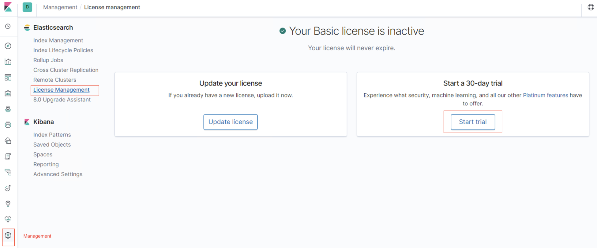


Click on the `Start my Trial` button in the resultant popup, as follows:

 
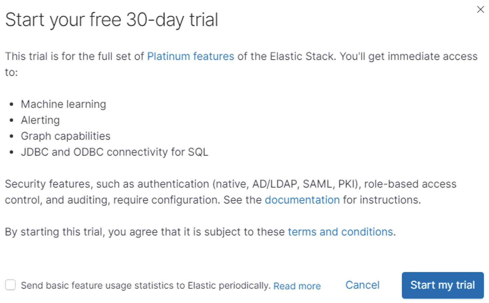


On successful activation, you should see the status of the license as
`Active`. At any point in time before the trial ends, you can go
ahead and revert back to the basic license by clicking on
the `Revert to Basic` button:


Open `elasticsearch.yml`, which can
be found under the `/elasticstack/elasticsearch-7.12.1/config` folder, and add the
following line at the end of the file to enable X-Pack and restart
Elasticsearch and Kibana:

```
xpack.security.enabled: true
```


**Note:** Make sure to stop elasticsearch and start again.


Now, when you try to access Elasticsearch via
`http://localhost:9200`, the user will be prompted for login
credentials, as shown in the following screenshot:


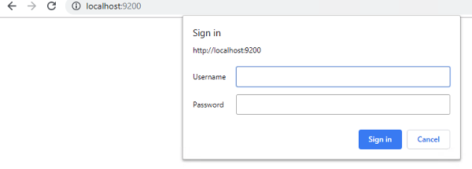


Similarly, if you see the logs of Kibana in the Terminal, it would fail
to connect to Elasticsearch due to authentication issues and won\'t come
up until we set the right credentials in the `kibana.yml` file.

Go ahead and stop Kibana. Let Elasticsearch run. Now that X-Pack is
enabled and security is in place, how do we know what credentials to use
to log in? We will look at this in the next section.


#### Generating passwords for default users


Elastic Stack security comes with default
users and a built-in credential helper to set up security with ease and
have things up and running quickly. Open up another Terminal. Let\'s generate the passwords for the
reserved/default users --- `elastic`, `kibana`,
`apm_system`, `remote_monitoring_user`,
`beats_system`, and `logstash_system` by executing
the following command:

```
elasticsearch-setup-passwords interactive
```

You should get the following logs/prompts to enter the password for the reserved/default users:

```
Initiating the setup of passwords for reserved users elastic,apm_system,kibana,logstash_system,beats_system,remote_monitoring_user.
You will be prompted to enter passwords as the process progresses.
Please confirm that you would like to continue [y/N]y

Enter password for [elastic]:elastic
Reenter password for [elastic]:elastic
Enter password for [apm_system]:apm_system
Reenter password for [apm_system]:apm_system
Enter password for [kibana]:kibana
Reenter password for [kibana]:kibana
Enter password for [logstash_system]:logstash_system
Reenter password for [logstash_system]:logstash_system
Enter password for [beats_system]:beats_system
Reenter password for [beats_system]:beats_system
Enter password for [remote_monitoring_user]:remote_monitoring_user
Reenter password for [remote_monitoring_user]:remote_monitoring_user
Changed password for user [apm_system]
Changed password for user [kibana]
Changed password for user [logstash_system]
Changed password for user [beats_system]
Changed password for user [remote_monitoring_user]
Changed password for user [elastic]
```


### Note

Please make a note of the passwords that have been set for the
reserved/default users. You can choose any password of your liking. We
have chosen the passwords as `elastic`, `kibana`,
`logstash_system`, `beats_system`,
`apm_system`, and
`remote_monitoring_user` for `elastic`, `kibana`, `logstash_system`, `beats_system`,
`apm_system`, and `remote_monitoring_user` users,
respectively, and we will be using them throughout this lab.


### Note

All the security-related information for the built-in users will be
stored in a special index called `.security` and will be
managed by Elasticsearch.


To verify X-Pack\'s installation and
enforcement of security, point your web browser to
`http://localhost:9200/` to open Elasticsearch. You should be
prompted to log in to Elasticsearch. To log in, you can use the
built-in `elastic` user and `elastic` password. Upon
logging in, you should see the following response:

```
{
  "name" : "MADSH01-APM01",
  "cluster_name" : "elasticsearch",
  "cluster_uuid" : "I2RVLSk2Rr6IRJb6zDf19g",
  "version" : {
    "number" : "7.0.0",
    "build_flavor" : "default",
    "build_type" : "zip",
    "build_hash" : "b7e28a7",
    "build_date" : "2019-04-05T22:55:32.697037Z",
    "build_snapshot" : false,
    "lucene_version" : "8.0.0",
    "minimum_wire_compatibility_version" : "6.7.0",
    "minimum_index_compatibility_version" : "6.0.0-beta1"
  },
  "tagline" : "You Know, for Search"
}
```

Before we can go ahead and start Kibana, we need to set the
Elasticsearch credentials in `kibana.yml` so that when we boot
up Kibana, it knows what credentials it needs to use for authenticating
itself/communicating with Elasticsearch.

Add the following credentials in the `kibana.yml` file, which
can be found under `$KIBANA_HOME/config`, and save it:

```
elasticsearch.username: "kibana"
elasticsearch.password: "kibana"
```


### Note

If you have chosen a different password for
the `kibana` user during password setup, use that value for
the `elasticsearch.password` property.


Start Kibana:

```
kibana
```

To verify that the authentication is in place, go
to `http://localhost:5601/` to open Kibana. You should be
prompted to login to Kibana. To log in, you can use the
built-in `elastic` user and the `elastic` password,
as follows:


Securing Elasticsearch and Kibana
---------------------------------------------------


The X-Pack security module provides the following ways to secure Elastic
Stack:


-   User authentication and user authorization
-   Node/Client authentication and channel encryption
-   Auditing


### Security in action


In this section, we will look into creating
new users, creating new roles, and associating roles with users. Let\'s
import some sample data and use it to understand how security works.

Save the following data to a file named `data.json`: 

```
{"index" : {"_index":"employee"}}
{ "name":"user1", "email":"user1@fenago.com","salary":5000, "gender":"M", "address1":"312 Main St", "address2":"Walthill", "state":"NE"}
{"index" : {"_index":"employee"}}
{ "name":"user2", "email":"user2@fenago.com","salary":10000, "gender":"F", "address1":"5658 N Denver Ave", "address2":"Portland", "state":"OR"}
{"index" : {"_index":"employee"}}
{ "name":"user3", "email":"user3@fenago.com","salary":7000, "gender":"F", "address1":"300 Quinterra Ln", "address2":"Danville", "state":"CA"}
{"index" : {"_index":"department","_type":"department"}}
{ "name":"IT", "employees":50 }
{"index" : {"_index":"department","_type":"department"}}
{ "name":"SALES", "employees":500 }
{"index" : {"_index":"department","_type":"department"}}
{ "name":"SUPPORT", "employees":100 }
```


### Note

The `_bulk` API requires the last line of the file to end with
the newline character, `\n`. While saving the file, make sure
that you have a newline as the last line of the file.


Navigate to the directory where the file is stored and execute the
following command to import the data into Elasticsearch: (run as root user)

```
cd /root/Desktop/elasticsearch/Lab08/
curl -s -H "Content-Type: application/json" -u elastic:elastic -XPOST http://localhost:9200/_bulk --data-binary @data.json
```

To check whether the import was successful, execute the following
command and validate the count of documents:

```
curl -s -H "Content-Type: application/json" -u elastic:elastic -XGET http://localhost:9200/employee,department/_count


{"count":6,"_shards":{"total":10,"successful":10,"skipped":0,"failed":0}}
```

#### Creating a new user


Let\'s explore the creation of a new user in
this section. Log in to Kibana (`http://locahost:5601`) as
the `elastic` user:


1.  To create a new user, navigate to the `Management` UI and
    select `Users` in the `Security` section:


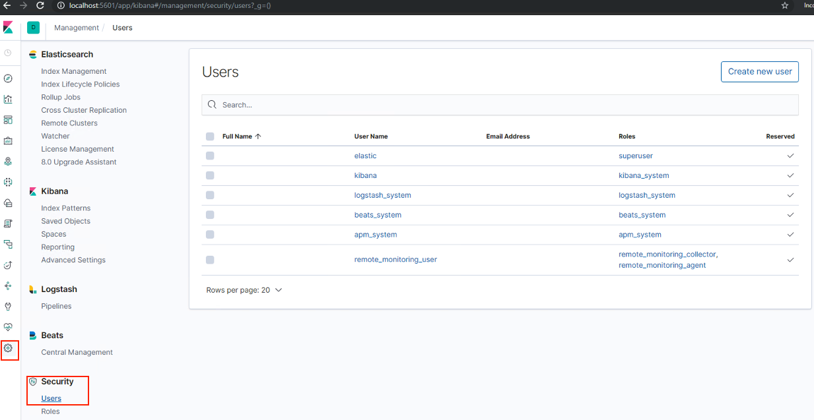


2.  The `Users` screen displays the available users and their roles.
    By default, it displays the default/reserved users that are part of
    the native X-Pack security realm:


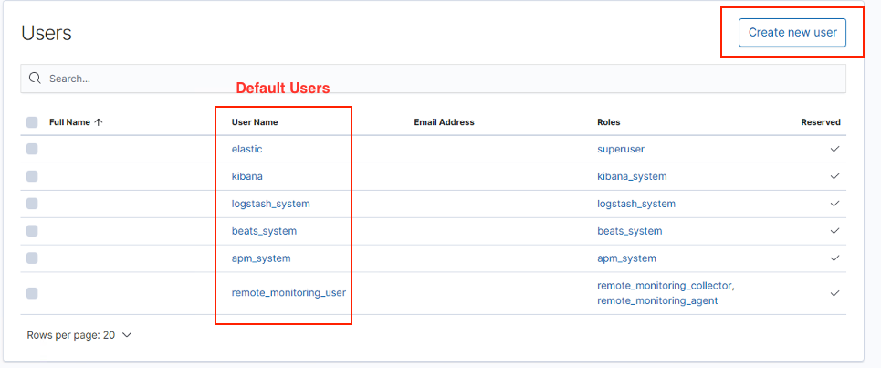


3.  To create a new user, click on the `Create new user` button and
    enter the required details, as shown in
    the following screenshot. Then, click on `Create user`:


Now that the user has been created, let\'s try to access some
Elasticsearch REST APIs with the new user credentials and see what
happens. Execute the following command and check the response that\'s
returned. Since the user doesn\'t have any role associated with them,
the authentication is successful. The user gets HTTP status
code `403`, stating that the user is not authorized to carry
out the operation:

```
curl -s -H "Content-Type: application/json" -u user1:password -XGET http://localhost:9200

Response:
{"error":{"root_cause":[{"type":"security_exception","reason":"action [cluster:monitor/main] is unauthorized for user [user1]"}],"type":"security_exception","reason":"action [cluster:monitor/main] is unauthorized for user [user1]"},"status":403}
```


4.  Similarly, go ahead and create one more user
    called `user2` with the password set as `password`.

##### Deleting a user


To delete a role, navigate to `Users` UI, select the custom `user2 `that you created, and click on
the **Delete** button. You cannot delete built-in users:


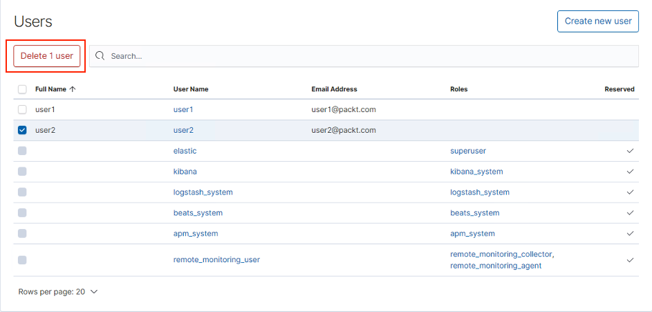


##### Changing the password


Navigate to the `Users` UI and select the custom
user for which the password needs to be
changed. This will take you to the `User Details` page. You can edit
the user\'s details, change their password, or delete the user from the
user details screen. To change the user\'s password, click on
the `Change password` link and enter the new password details. Then,
click on the `Update user` button:


### Note

The passwords must be a minimum of 6 characters long.


#### Creating a new role


To create a new user, navigate to
the `Management` UI and select `Roles `in
the `Security` section, or if you are currently on
the `Users` screen, click on the `Roles` tab.
The `Roles` screen displays all the roles that are
defined/available. By default, it displays the built-in/reserved roles
that are part of the X-Pack security native realm:


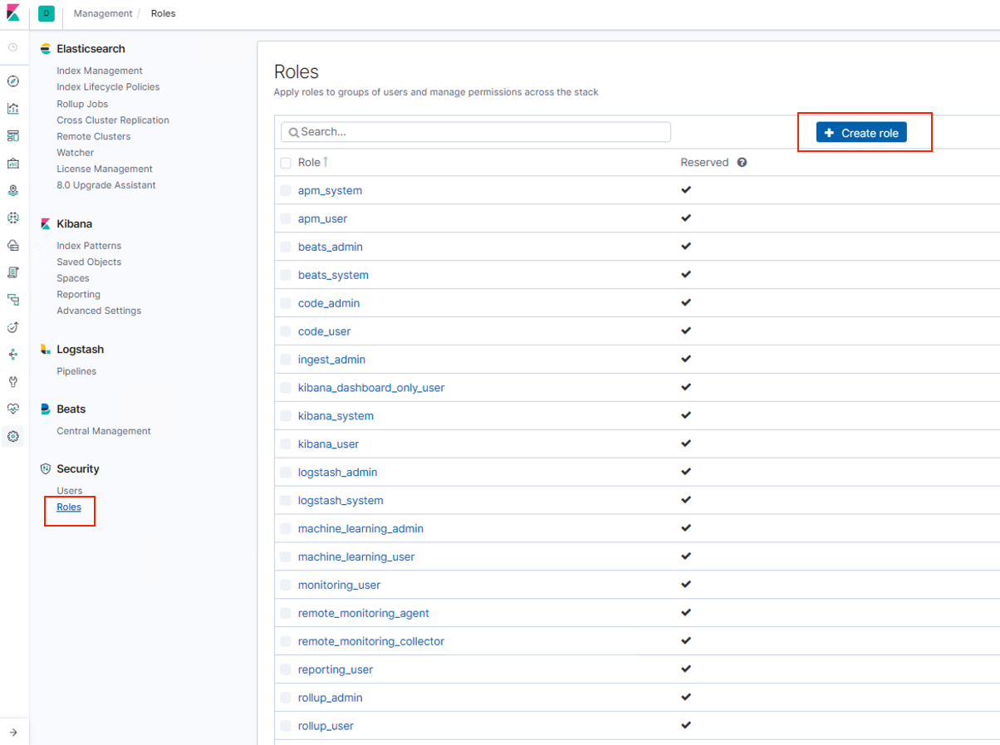


X-Pack security also provides a set of built-in roles that can be
assigned to users. These roles are reserved and the privileges
associated with these roles cannot be updated. Some of the built-in
roles are as follows:


-   `kibana_system`: This role grants the necessary access to
    read from and write to Kibana indexes,
    manage index templates, and check the availability of the
    Elasticsearch cluster. This role also grants read access for
    monitoring (`.monitoring-*`) and read-write
    access to reporting
    (`.reporting-*`) indexes. The default
    user, `kibana`, has these privileges.
-   `superuser`: This role grants access for performing all
    operations on clusters, indexes, and data. This role also grants
    rights to create/modify users or roles. The default
    user, `elastic`, has superuser privileges.
-   `ingest_admin`: This role grants permissions so
    that you can manage all pipeline
    configurations and all index templates.


### Note

To find the complete list of built-in roles and their descriptions,
please refer
to <https://www.elastic.co/guide/en/x-pack/master/built-in-roles.html>.


Users with the superuser role can create custom roles
and assign them to the users using the Kibana
UI.

Let\'s create a new role with a **Cluster
privilege** called `monitor` and assign it
to `user1` so that the user can cluster read-only operations
such as cluster state, cluster health, nodes info, nodes stats, and
more.

Click on the `Create role` button in the `Roles` page/tab and
fill in the details that are shown in the following screenshot:


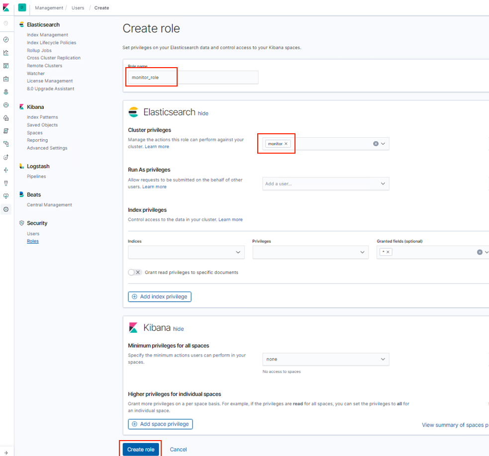


To assign the newly created role to `user1`, click on
the `Users` tab and select `user1`. In
the `User Details` page, from the roles dropdown, select
the `monitor_role` role and click
on the `Save` button, as shown in the following screenshot:


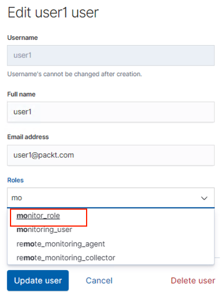


### Note

A user can be assigned multiple roles.


Now, let\'s validate that `user1` can access some cluster/node
details APIs:

```
curl -u user1:password "http://localhost:9200/_cluster/health?pretty"
{
  "cluster_name" : "elasticsearch",
  "status" : "yellow",
  "timed_out" : false,
  "number_of_nodes" : 1,
  "number_of_data_nodes" : 1,
  "active_primary_shards" : 5,
  "active_shards" : 5,
  "relocating_shards" : 0,
  "initializing_shards" : 0,
  "unassigned_shards" : 2,
  "delayed_unassigned_shards" : 0,
  "number_of_pending_tasks" : 0,
  "number_of_in_flight_fetch" : 0,
  "task_max_waiting_in_queue_millis" : 0,
  "active_shards_percent_as_number" : 71.42857142857143
}
```

Let\'s also execute the same command that we executed when we created `user2`, but without assigning any
roles to it, and see the difference:

```
curl -u user2:password "http://localhost:9200/_cluster/health?pretty"
{
  "error" : {
    "root_cause" : [
      {
        "type" : "security_exception",
        "reason" : "action [cluster:monitor/main] is unauthorized for user [user2]"
      }
    ],
    "type" : "security_exception",
    "reason" : "action [cluster:monitor/main] is unauthorized for user [user2]"
  },
  "status" : 403
}
```

##### Deleting or editing a role


To delete a role, navigate to
the `Roles `UI/tab, select the custom
role that we created, and click on **Delete**. You cannot
delete built-in roles:


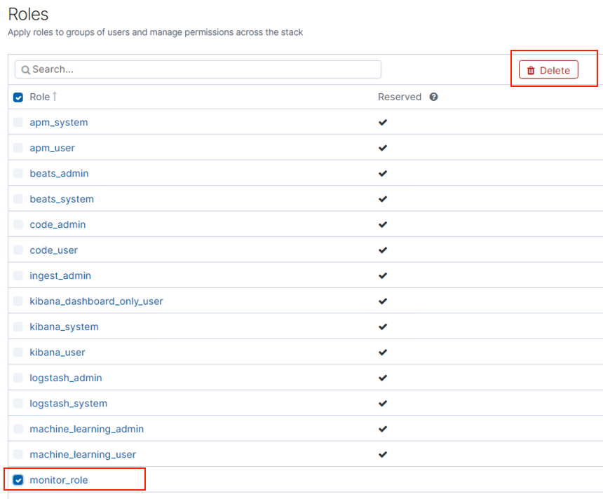


To edit a role, navigate to the `Roles` UI/tab and click on the
custom role that needs to be edited. The user is taken to
the `Roles Details` page. Make the required changes in the
`Privileges` section and click on the `Update role` button.

You can also delete the role from this page:


#### Document-level security or field-level security


Now that we know how to create a new
user, create a new role, and assign roles to a user, let\'s explore how
security can be imposed on documents and fields for a given
index/document.

The sample data that we imported previously, at the
beginning of this lab, contained two
indexes: `employee` and `department`. Let\'s use
these indexes and understand the document-level security with two use
cases.

**Use case 1**: When a user searches for employee details,
the user should not be able to find the salary/address details contained
in the documents belonging to the `employee` index.

This is where field-level security helps. Let\'s create a new role
(`employee_read`) with `read` index privileges on
the `employee` index. To restrict the fields, type the actual
field names that are allowed to be accessed by the user in
the `Granted Fields` section, as shown in the following screenshot,
and click the `Create role` button:


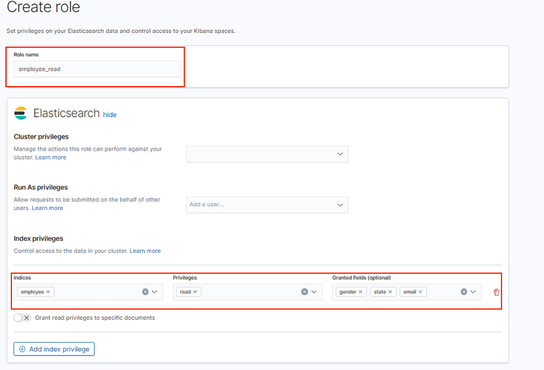


### Note

When creating a role, you can specify the same set of privileges on
multiple indexes by adding one or more index names to
the `Indices` field, or you can specify different privileges for
different indexes by clicking on the **Add index
privilege** button that\'s found in
the `Index privileges` section.


Assign the newly created role to `user2`:


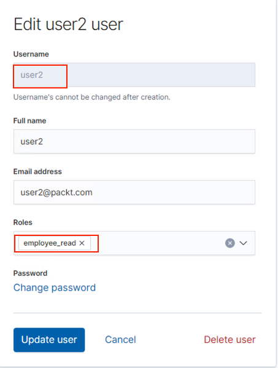


 

Now, let\'s search in the employee index and
check what fields were returned in the
response. As we can see in the following response, we have successfully
restricted the user from accessing salary and address details:

```
curl -u user2:password "http://localhost:9200/employee/_search?pretty"
{
  "took" : 1,
  "timed_out" : false,
  "_shards" : {
    "total" : 1,
    "successful" : 1,
    "skipped" : 0,
    "failed" : 0
  },
  "hits" : {
    "total" : {
      "value" : 3,
      "relation" : "eq"
    },
    "max_score" : 1.0,
    "hits" : [
      {
        "_index" : "employee",
        "_type" : "_doc",
        "_id" : "xsTc2GoBlyaBuhcfU42x",
        "_score" : 1.0,
        "_source" : {
"gender" : "M",
          "state" : "NE",
          "email" : "user1@fenago.com"
        }
      },
      {
        "_index" : "employee",
        "_type" : "_doc",
        "_id" : "x8Tc2GoBlyaBuhcfU42x",
        "_score" : 1.0,
        "_source" : {
 "gender" : "F",
          "state" : "OR",
          "email" : "user2@fenago.com"
        }
      },
      {
        "_index" : "employee",
        "_type" : "_doc",
        "_id" : "yMTc2GoBlyaBuhcfU42x",
        "_score" : 1.0,
        "_source" : {
 "gender" : "F",
          "state" : "CA",
          "email" : "user3@fenago.com"
        }
      }
    ]
  }
}
```

**Use case 2**: We want to have a multi-tenant index and
restrict certain documents to certain users. For
example, `user1` should be able to search in the department
index and retrieve only documents belonging to
the `IT` department.

Let\'s create a role, `department_IT_role`, and provide
the `read` privilege for the `department` index. To
restrict the documents, specify the query in
the `Granted Documents Query` section. The query should be in
the **Elasticsearch Query DSL** format:


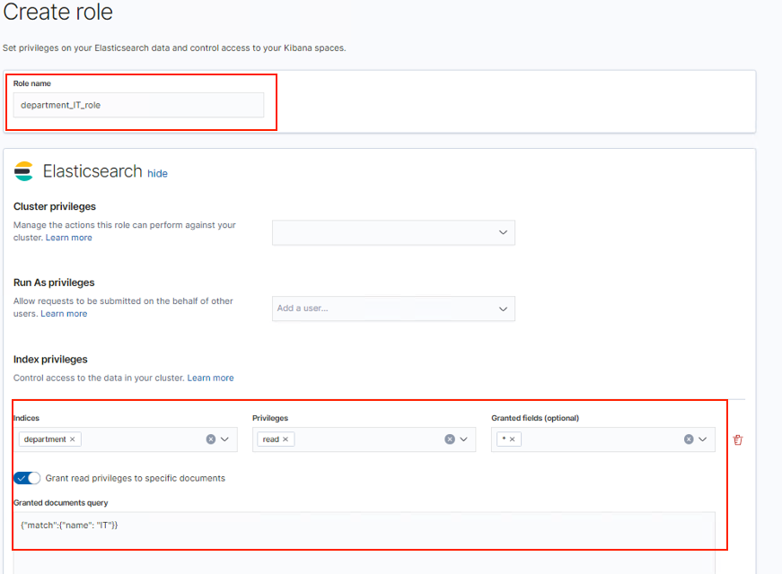


Associate the newly created role with `user1`:


Let\'s verify that it is working as expected by executing a search
against the `department` index using
the `user1` credentials:

```
curl -u user1:password "http://localhost:9200/department/_search?pretty"
{
  "took" : 19,
  "timed_out" : false,
  "_shards" : {
    "total" : 1,
    "successful" : 1,
    "skipped" : 0,
    "failed" : 0
  },
  "hits" : {
    "total" : {
      "value" : 1,
      "relation" : "eq"
    },
    "max_score" : 1.0,
    "hits" : [
      {
        "_index" : "department",
        "_type" : "department",
        "_id" : "ycTc2GoBlyaBuhcfU42x",
        "_score" : 1.0,
        "_source" : {
"name" : "IT",
          "employees" : 50
        }
      }
    ]
  }
```


#### X-Pack security APIs


In the previous section, we learned how to
manage users and roles using the Kibana UI. However, often, we would
like to carry out these operations programmatically from our
applications. This is where the X-Pack security APIs come in handy.
X-Pack security APIs are REST APIs that can be used for user/role
management, role mapping to users, performing authentication, and
checking whether the authenticated user has specified a list of
privileges. These APIs perform operations on
the `native` realm. The Kibana UI internally makes use of
these APIs for user/role management. In order to execute these APIs, the
user should have `superuser` or the
latest `manage_security` privileges. Let\'s explore some of
these APIs in this section.


##### User Management APIs


This provides a set of APIs to create,
update, or delete users from
the `native` realm. 

The following is a list of available APIs and how to use them:

```
GET /_xpack/security/user                             -- To list all the users
GET /_xpack/security/user/<username>                  -- To get the details of a specific user
DELETE /_xpack/security/user/<username>               -- To Delete a user
POST /_xpack/security/user/<username>                 -- To Create a new user
PUT /_xpack/security/user/<username>                  -- To Update an existing user
PUT /_xpack/security/user/<username>/_disable         -- To disable an existing user
PUT /_xpack/security/user/<username>/_enable          -- To enable an existing disabled user
PUT /_xpack/security/user/<username>/_password        -- to Change the password
```

The `username` in the path parameter specifies the user
against which the operation is carried out. The body of the request
accepts parameters such as `email`, `full_name`,
and `password` as strings and `roles` as list.

**Example 1**: Create a new user, `user3`,
with `monitor_role` assigned to it:

```
curl -u elastic:elastic -X POST http://localhost:9200/_xpack/security/user/user3 -H 'content-type: application/json' -d '
{
  "password" : "randompassword",
  "roles" : [ "monitor_role"],
  "full_name" : "user3",
  "email" : "user3@fenago.com"

}'

Response:
user":{"created":true}}
```

 **Example 2**: Get the list of
all users:

```
curl -u elastic:elastic -XGET http://localhost:9200/_xpack/security/user?pretty
```

**Example 3**: Delete `user3`:

```
curl -u elastic:elastic -XDELETE http://localhost:9200/_xpack/security/user/user3
Response:
{"found":true}
```

**Example 4**: Change the
password:

```
curl -u elastic:elastic -XPUT http://localhost:9200/_xpack/security/user/user2/_password -H "content-type: application/json" -d "{ \"password\": \"newpassword\"}"
```


### Note

When using `curl` commands on Windows machines, note that they
don\'t work if they have single quotes (\') in them. The preceding
example showed the use of a `curl` command on a Windows
machine. Also, make sure you escape double quotes within the body of the
command, as shown in the preceding example.


##### Role Management APIs


This provides a set of APIs to create,
update, remove, and retrieve roles from the
`native` realm.

The list of available APIs under this section, as well as information on
what they do, is as follows:

```
GET /_xpack/security/role                               -- To retrieve the list of all roles 
GET /_xpack/security/role/<rolename>                        -- To retrieve details of a specific role
POST /_xpack/security/role/<rolename>/_clear_cache          -- To evict/clear roles from the native role cache
POST /_xpack/security/role/<rolename>                       -- To create a role
PUT /_xpack/security/role/<rolename>                        -- To update an existing role
```

The `rolename` in the path parameter specifies the role
against which the operation is carried out. The body of the request
accepts parameters such as `cluster`, which accepts a list of
cluster privileges; `indices`, which accepts a list of objects
that specify the indices privileges and `run_as`, which
contains a list of users that the owners of this role can impersonate.

`indices` contains an object with parameters such
as `names`, which accepts a list of index
names; `field_security`, which accepts a list of fields to
provide read access; `privileges`, which accepts a list of
index privileges; and the `query` parameter, which accepts the
query to filter the documents.

Let\'s take a look at a few examples of managing different roles using
APIs:


-   **Example 1**: Create a new role with field-level
    security imposed on the employee index:


```
curl -u elastic:elastic -X POST http://localhost:9200/_xpack/security/role/employee_read_new -H 'content-type: application/json' -d '{

  "indices": [
    {
      "names": [ "employee" ],
      "privileges": [ "read" ],
      "field_security" : {
        "grant" : [ "*" ],
        "except": [ "address*","salary" ]
      }

    }
  ]
}'

Response:
role":{"created":true}}
```


### Note

Unlike the Kibana UI, which doesn\'t have any way to exclude fields from
user access, using the Security API, you can easily exclude or include
fields as part of field-level security. In the preceding example, we
have restricted access to the `salary` field and any fields
starting with the `address` text/string. 


-   **Example 2**: Get the details of a specific role:


```
curl -u elastic:elastic -XGET http://localhost:9200/_xpack/security/role/employee_read_new?pretty
Response:
{
  "employee_read" : {
    "cluster" : [ ],
    "indices" : [
      {
        "names" : [
          "employee"
        ],
        "privileges" : [
          "read"
        ],
        "field_security" : {
          "grant" : [
            "*"
          ],
          "except" : [
            "address*",
            "salary"
          ]
        }
      }
    ],
    "run_as" : [ ],
    "metadata" : { },
    "transient_metadata" : {
      "enabled" : true
    }
  }
}
```


-   **Example 3**: Delete a role:


```
curl -u elastic:elastic -XDELETE http://localhost:9200/_xpack/security/role/employee_read

Response:
{"found":true}
```


### Monitoring UI


To access the Monitoring UI, log in to Kibana and click on Stack Monitoring from the side navigation.
If the monitoring data collection is not enabled, you will be taken to
the following screen, where you can enable monitoring by clicking on
the `Turn on monitoring` button. By default, monitoring would be
enabled but data collection would be disabled. These settings can be
dynamic and can be updated using the **cluster update
settings** API, which doesn\'t require a restart to occur. If
the same settings were set in `elasticsearch.yml` or
`kibana.yml`, a restart would be required:


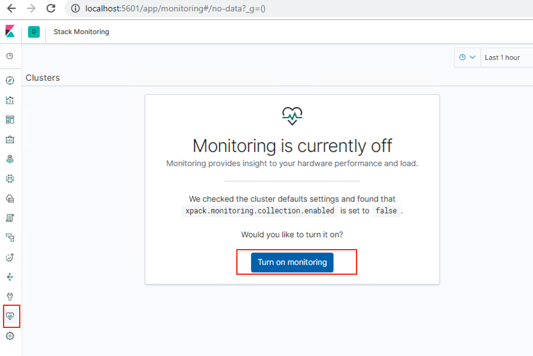


Once you click on `Turn on monitoring`, the cluster settings will
update, which can be verified by using the following API:

```
curl -u elastic:elastic -XGET http://localhost:9200/_cluster/settings?pretty
{
  "persistent" : {
"xpack" : {
      "monitoring" : {
        "collection" : {
          "enabled" : "true"
        }
      }
    }
  },
  "transient" : { }
}
```


Once data collection has been enabled, click on the Stack Monitoring
icon on the left-hand side menu. You will see the following screen:


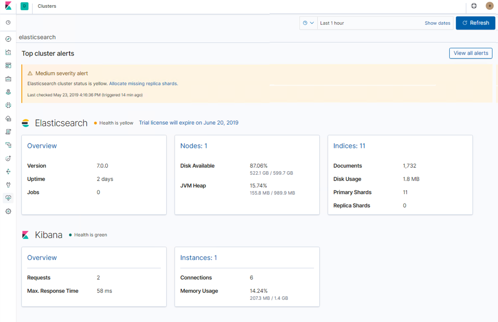


This page provides a summary of the metrics that are available for
Elasticsearch and Kibana. By clicking on links such
as `Overview`, `Nodes`, `Indices`, or `Instances`, you
can get additional/detailed information. The metrics that are displayed
on the page are automatically refreshed every 10 seconds, and by
default, you can view the data of the past 1 hour, which can be changed
in the `Time Filter` that\'s found toward the top left of the
screen. You can also see the cluster name, which in this case
is  `elasticsearch` .


### Note

The monitoring agent that\'s installed on the instances being monitored
sends metrics every 10 seconds by default. This can be changed in the
configuration file (`elasticsearch.yml`) by setting the
appropriate value to the
`xpack.monitoring.collection.interval` property.


### Anatomy of a watch


Let\'s look into a sample watch and understand the building blocks of a
watch in detail. The following code snippet creates a watch:

```
curl -u elastic:elastic -X POST  http://localhost:9200/_xpack/watcher/watch/logstash_error_watch   -H 'content-type: application/json'   -d '{
"trigger":{"schedule":{"interval":"30s"}},"input":{"search":{"request":{"indices":["logstash*"],"body":{"query":{"match":{"message":"error"}}}}}},"condition":{"compare":{"ctx.payload.hits.total":{"gt":0}}},"actions":{"log_error":{"logging":{"text":"The number of errors in logs is  {{ctx.payload.hits.total}}"}}}}'
```


### Alerting in action


Now that we know what a **Watch** is made up of, in this section, we will explore
how to create, delete, and manage watches.

You can create/delete/manage watches using the following software:


-   Kibana Watcher UI
-   X-Pack Watcher REST APIs


The **Watcher** UI internally makes use of Watcher REST APIs
for the management of watches. In this section, we will explore the
creation, deletion, and management of watches using the Kibana Watcher
UI.


#### Creating a new alert


To create a watch, log in to Kibana
(`http://localhost:5601`) as elastic/elastic and navigate
to the `Management` UI; click on `Watcher` in
the `Elasticsearch` section. Two options are available for creating
alerts:


-   `Create threshold alert`
-   `Create advanced watch`:


By using the `Threshold alert` option, you can create a
threshold-based alert to get notified when a metric goes above or below
a given threshold. Using this UI, users can easily create
threshold-based alerts without worrying about directly working with raw
JSON requests. This UI provides options for creating alerts on
time-based indices only (that is, the index has a timestamp).

Using the `Advanced watch` options, you can create watches by
directly working with the raw `.json` required for the watches
API.


### Note

The Watcher UI requires a user with `kibana_user` and
`watcher_admin` privileges to create, edit, delete, and
deactivate a watch.

##### Threshold Alert


Click on `Create New Watch` and choose the `Threshold Alert` option. This brings up the
`Threshold Alert` UI.

Specify the name of the alert; choose the index to be used to query
against, the time field, and the trigger frequency in
the `Threshold Alert` UI:


Then, specify the condition that will cause the alert to trigger. As the
expressions/conditions are changed or modified, the visualization is
updated automatically to show the threshold value and data as red and
blue lines, respectively:


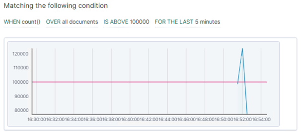


Finally, specify the action that needs to be triggered when the action
is met by clicking on the `Add new action` button. It provides three
types of actions, that is, email, slack, and logging actions. One or
more actions can be configured:


Then, click on the `Save` button to create the watch.

Clicking on `Save` will save the watch in
the `watches` index and can be validated using the following
query:

```
curl -u elastic:elastic -XGET http://localhost:9200/.watches/_search?q=metadata.name:logs_watch
```


##### Advanced Watch


Click on the `Create New Watch` button and choose the `Advanced Watch` option. This brings up
the `Advanced Watch` UI.

Specify the watch `ID` and watch `name`, and then paste the JSON
to create a watch in the `Watch JSON` box; click on `Save` to
create a watch. Watch ID refers to the identifier used by Elasticsearch
when creating a Watch, whereas name is the more user-friendly way to
identify the watch:


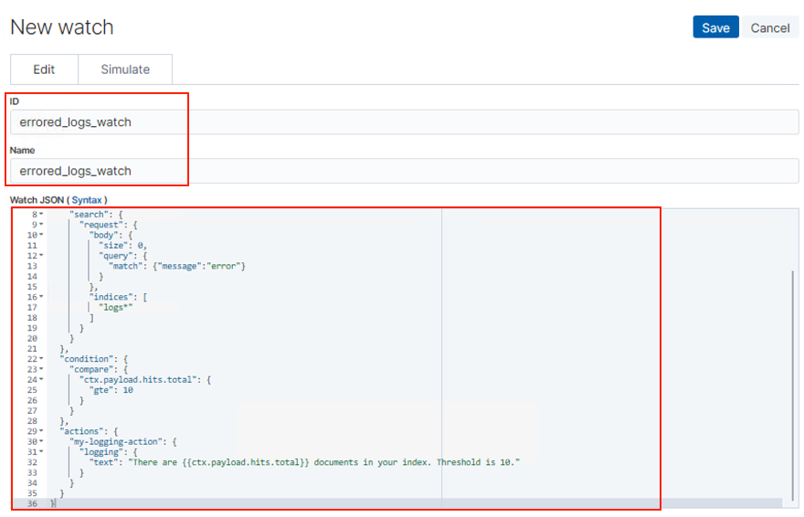


The `Simulate` tab provides a UI to override parts of the watch and
then run a simulation of it.


### Note

Watch Name will be stored in the metadata section of the watch body. You
can use the metadata section when creating the watch to store custom
metadata, tags, or information to represent/identify a watch.


Clicking on `Save` will save the watch in
the `watches` index and can be validated using the following
query:

```
curl -u elastic:elastic -XGET http://localhost:9200/.watches/_search?q=metadata.name:errored_logs_watch
```

Since we have configured logging as the action, when the alert is
triggered, the same can be seen in `elasticsearch.log`:


#### Deleting/deactivating/editing a watch


To delete a watch, navigate to the `Management` UI and click on `Watcher` in
the `Elasticsearch` section. From the `Watches` list, select one
or more watches that need to be
deleted and click on the `Delete` button:


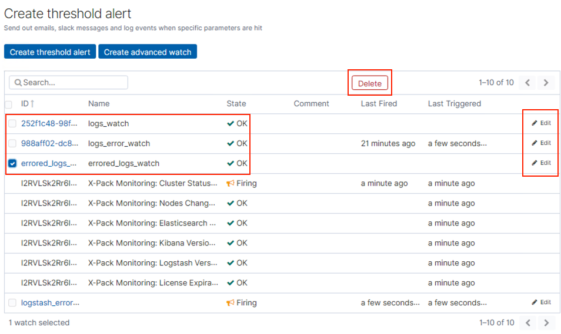


To edit a watch, click on the `Edit` link, modify the watch details,
and click on the `Save` button to save your changes. To deactivate a
watch (that is, to temporarily disable watch execution), navigate to
the `Management` UI and click on `Watcher` in
the `Elasticsearch` section. From the `Watches` list, click on
the custom watch. The `Watch History` will be displayed. Click on
the `Deactivate` button. You can also delete a watch from this
screen.

Clicking on an execution time (link) in the `Watch History` displays
the details of a particular `watch_record`:


Summary
-------------------------

In this lab, we explored how to install and configure the X-Pack
components in Elastic Stack and how to secure the Elastic cluster by
creating users and roles. We also learned how to monitor
the Elasticsearch server and alerting in order to generate notifications
when there are changes or anomalies in the data.
