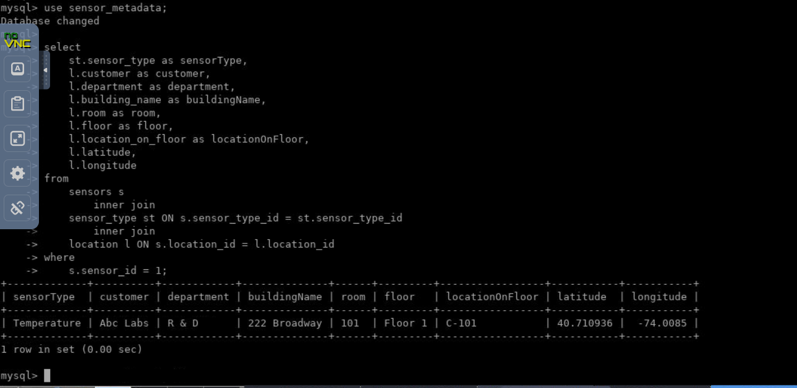
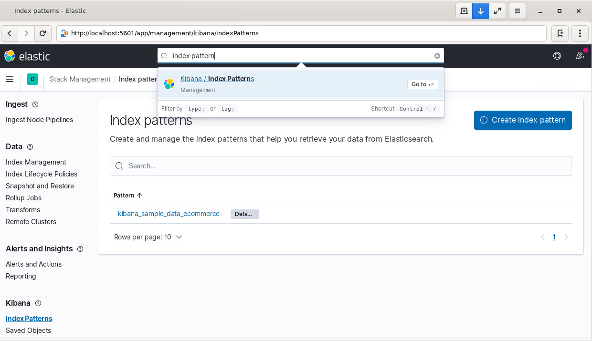
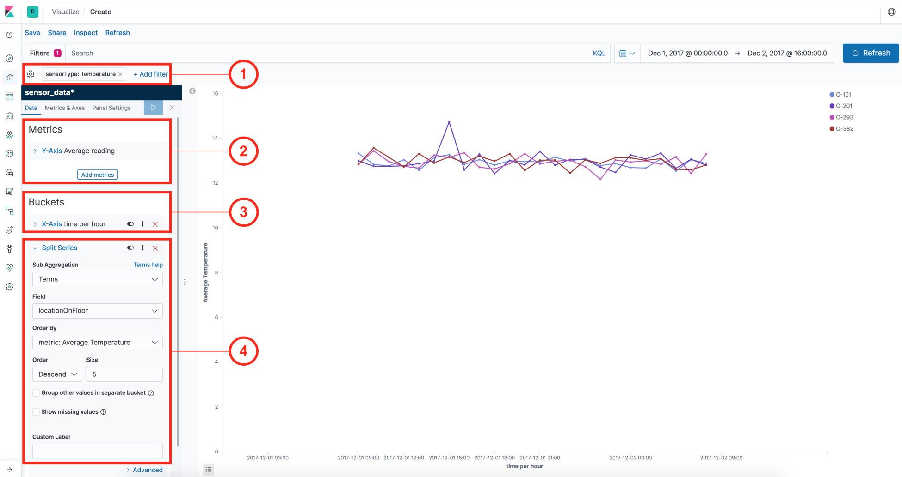
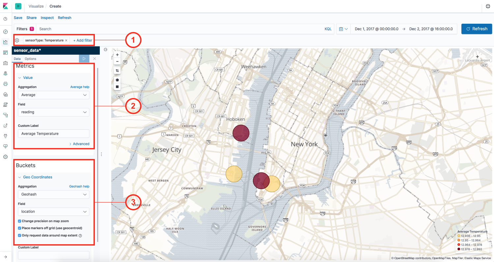
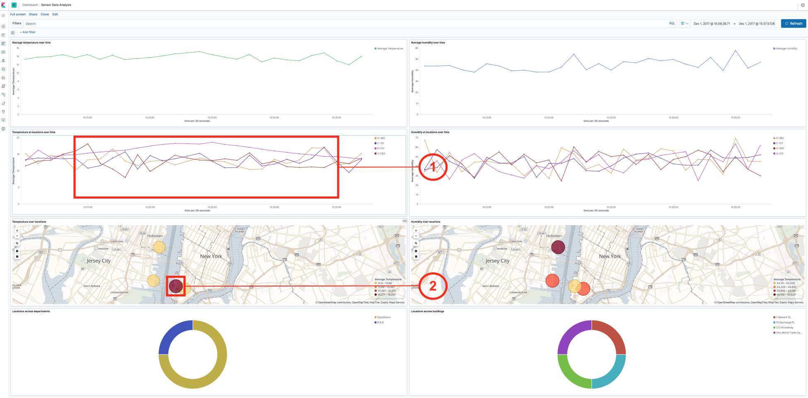

Lab 10. Building a Sensor Data Analytics Application
-----------------------------------------------------------------


In this lab, we will cover the following topics as we build a sensor-data analytics
application:


-   Introduction to the application
-   Modeling data in Elasticsearch
-   Setting up the metadata database
-   Building the Logstash data pipeline
-   Sending data to Logstash over HTTP
-   Visualizing the data in Kibana


Let\'s go through the topics.


### Understanding the sensor-generated data


What does the data look like when it is generated by the sensor? The
sensor sends JSON-format data over the
internet and each reading looks like the following:

```
{
  "sensor_id": 1,
  "time": 1511935948000,
  "value": 21.89
} 
```


### Understanding the sensor metadata

This information is stored in the following three tables in MySQL:

- `sensor_type`: Defines various sensor types and their `sensor_type_id`:


- `location`: This defines locations with their latitude/longitude and address within a physical  building:


- `sensors`: This  maps `sensor_id` with sensor types and locations:


 

Let\'s look at the index template that we will define.


#### Defining an index template

Since we are going to be storing time series data that is immutable, we do not want to  create one big monolithic index.

1. Create the following index template by executing the command in the your Kibana - Dev Tools. 

```
POST _template/sensor_data_template
{
  "index_patterns": [
    "sensor_data*"
  ],
  "settings": {
    "number_of_replicas": "1",
    "number_of_shards": "5"
  },
  "mappings": {
    "properties": {
      "sensorId": {
        "type": "integer"
      },
      "sensorType": {
        "type": "keyword",
        "fields": {
          "analyzed": {
            "type": "text"
          }
        }
      },
      "customer": {
        "type": "keyword",
        "fields": {
          "analyzed": {
            "type": "text"
          }
        }
      },
      "department": {
        "type": "keyword",
        "fields": {
          "analyzed": {
            "type": "text"
          }
        }
      },
      "buildingName": {
        "type": "keyword",
        "fields": {
          "analyzed": {
            "type": "text"
          }
        }
      },
      "room": {
        "type": "keyword",
        "fields": {
          "analyzed": {
            "type": "text"
          }
        }
      },
      "floor": {
        "type": "keyword",
        "fields": {
          "analyzed": {
            "type": "text"
          }
        }
      },
      "locationOnFloor": {
        "type": "keyword",
        "fields": {
          "analyzed": {
            "type": "text"
          }
        }
      },
      "location": {
        "type": "geo_point"
      },
      "time": {
        "type": "date"
      },
      "reading": {
        "type": "double"
      }
    }
  }
}
```

2. Switch user from terminal: `su elasticsearch`
3. Logstash has been already downloaded at following path: `/elasticstack/logstash-7.12.1`.
4. Files have been already copied at path `/elasticstack/logstash-7.12.1/files_mysql` . The structure of files should look like -


```
/elasticstack/logstash-7.12.1/files_mysql/logstash_sensor_data_http.conf
```

**Note:** Open new terminal and run MYSQL commands as root user.

4. Ensure that you MySQL server is running:

`service mysql status`

6. Login to the MySQL database using a command-line mysql client where SQL scripts can be executed. Execute the script in the create_sensor_metadata.sql to load the metadata into the MySQL database.

Execute in Terminal:
`mysql -uroot -pfenago`

Execute in mysql shell: 
`source /root/Desktop/elasticsearch/Lab09/files_mysql/create_sensor_metadata.sql`


7. Start logstash from command line, using the following commands

```
su elasticsearch
cd /elasticstack/logstash-7.12.1
logstash  -f files_mysql/logstash_sensor_data_http.conf
```

This index template will create a new index with the name
`sensor_data-YYYY.MM.dd` when any client attempts to index the
first record in this index.


Setting up the metadata database
--------------------------------------------------


Log in to the newly created `sensor_metadata` database and verify that the three tables, `sensor_type`, `locations`, and` sensors` exist in the database.

`mysql -uroot -pfenago`


You can verify that the database was created and populated successfully
by executing the following query:

```
use sensor_metadata;

select 
    st.sensor_type as sensorType,
    l.customer as customer,
    l.department as department,
    l.building_name as buildingName,
    l.room as room,
    l.floor as floor,
    l.location_on_floor as locationOnFloor,
    l.latitude,
    l.longitude
from
    sensors s
        inner join
    sensor_type st ON s.sensor_type_id = st.sensor_type_id
        inner join
    location l ON s.location_id = l.location_id
where
    s.sensor_id = 1; 
```

The result of the previous query will look like this:



 

Our `sensor_metadata` database is ready to look up the
necessary sensor metadata. In the next section, we will build the
Logstash data pipeline.


### Accepting JSON requests over the web


This function is achieved by the input
plugin. Logstash has support for the `http` input plugin,
which does precisely that. It builds an HTTP interface using different
types of payloads that can be submitted to Logstash as an input.

The relevant part from `logstash_sensor_data_http.conf`, which
has the input filter, is as follows:

```
input {
  http {
    id => "sensor_data_http_input"
  }
}
```

Here, the `id` field is a string that can uniquely identify
this input filter later in the file if needed. We will not need to
reference this name in the file; we just choose the name
`sensor_data_http_input`.

In this instance, since we are using the default configuration of
the `http` input plugin, we have just
specified `id`. We should secure this HTTP endpoint as it will be exposed over the internet to allow
sensors to send data from anywhere. We can
configure `user` and `password` parameters to
protect this endpoint with the desired username and password, as
follows:

```
input {
  http {
    id => "sensor_data_http_input"
    user => "sensor_data"
    password => "sensor_data"
  }
}
```

When Logstash is started with this input plugin, it starts an HTTP
server on port `8080`, which is secured using basic
authentication with the given username and password. We can send a
request to this Logstash pipeline using a `curl` command, as
follows:

```
curl -XPOST -u sensor_data:sensor_data --header "Content-Type: application/json" "http://localhost:8080/" -d '{"sensor_id":1,"time":1512102540000,"reading":16.24}'
```

Let\'s see how we will enrich the JSON payload with the metadata we have in MySQL.


### Enriching the JSON with the metadata we have in the MySQL database

Logstash has a `jdbc_streaming` filter plugin that can be used
to do lookups from any relational database and enrich the incoming JSON
documents. Let\'s zoom into the filter plugin section in our Logstash
configuration file:

```
filter {
  jdbc_streaming {
    jdbc_driver_library => "/home/elasticsearch/mysql-connector-java-8.0.25.jar"
    jdbc_driver_class => "com.mysql.jdbc.Driver"
    jdbc_connection_string => "jdbc:mysql://localhost:3306/sensor_metadata"
    jdbc_user => "root"
    jdbc_password => "fenago"
    statement => "select st.sensor_type as sensorType, l.customer as customer, l.department as department, l.building_name as buildingName, l.room as room, l.floor as floor, l.location_on_floor as locationOnFloor, l.latitude, l.longitude from sensors s inner join sensor_type st on s.sensor_type_id=st.sensor_type_id inner join location l on s.location_id=l.location_id where s.sensor_id= :sensor_identifier"
    parameters => { "sensor_identifier" => "sensor_id"}
    target => lookupResult
  }

  mutate {
    rename => {"[lookupResult][0][sensorType]" => "sensorType"}
    rename => {"[lookupResult][0][customer]" => "customer"}
    rename => {"[lookupResult][0][department]" => "department"}
    rename => {"[lookupResult][0][buildingName]" => "buildingName"}
    rename => {"[lookupResult][0][room]" => "room"}
    rename => {"[lookupResult][0][floor]" => "floor"}
    rename => {"[lookupResult][0][locationOnFloor]" => "locationOnFloor"}
    add_field => {
      "location" => "%{[lookupResult][0][latitude]},%{[lookupResult][0][longitude]}"
    }
    remove_field => ["lookupResult", "headers", "host"]
  }

}
```

As you will notice, there are two filter plugins used in the file:

-   `jdbc_streaming`
-   `mutate`


Let\'s see what each filter plugin is doing.


#### The jdbc\_streaming plugin 


The resulting document, up to this point, should look like this:

```
{
  "sensor_id": 1,
  "time": 1512113760000,
  "reading": 16.24,
  "lookupResult": [
    {
      "buildingName": "222 Broadway",
      "sensorType": "Temperature",
      "latitude": 40.710936,
      "locationOnFloor": "Desk 102",
      "department": "Engineering",
      "floor": "Floor 1",
      "room": "101",
      "customer": "Linkedin",
      "longitude": -74.0085
    }
  ],
  "@timestamp": "2019-05-26T05:23:22.618Z",
  "@version": "1",
  "host": "0:0:0:0:0:0:0:1",
  "headers": {
    "remote_user": "sensor_data",
    "http_accept": "*\/*",
    ...
  }
}
```

As you can see, the `jdbc_streaming` filter plugin added some
fields apart from the `lookupResult` field. These fields were
added by Logstash and the `headers` field was added by the
HTTP input plugin.

In the next section, we will use the `mutate` filter plugin to
modify this JSON to the desired end result that we want in
Elasticsearch. 

#### The mutate plugin


As we have seen in the previous section, the
output of
the `jdbc_streaming` filter plugin has some undesired aspects.
Our JSON payload needs the following modifications:


-   Move the looked-up fields that are
    under `lookupResult` directly into the JSON file.
-   Combine the latitude and longitude fields under
    `lookupResult` as a location field.
-   Remove the unnecessary fields.


```
mutate {
    rename => {"[lookupResult][0][sensorType]" => "sensorType"}
    rename => {"[lookupResult][0][customer]" => "customer"}
    rename => {"[lookupResult][0][department]" => "department"}
    rename => {"[lookupResult][0][buildingName]" => "buildingName"}
    rename => {"[lookupResult][0][room]" => "room"}
    rename => {"[lookupResult][0][floor]" => "floor"}
    rename => {"[lookupResult][0][locationOnFloor]" => "locationOnFloor"}
    add_field => {
      "location" => "%{lookupResult[0]latitude},%{lookupResult[0]longitude}"
    }
    remove_field => ["lookupResult", "headers", "host"]
  }
```

Let\'s see how the `mutate` filter plugin achieves these
objectives.


##### Moving the looked-up fields that are under lookupResult directly in JSON


For example, the following operation renames the
existing `sensorType` field directly under the JSON payload:

```
rename => {"[lookupResult][0][sensorType]" => "sensorType"}
```

We do this for all the looked-up fields that are returned by the SQL query.


##### Combining the latitude and longitude fields under lookupResult as a location field


Remember when we defined the index template
mapping for our index? We defined the `location` field to be
of `geo_point` type. The `geo_point` type accepts a
value that is formatted as a string with latitude and longitude appended
together, separated by a comma.

This is achieved by using the `add_field` operation to construct the `location` field, as follows:

```
 add_field => {
  "location" => "%{[lookupResult][0][latitude]},%{[lookupResult][0][longitude]}"
 }
```

By now, we should have a new field called `location` added to
our JSON payload, exactly as desired. Next, we will remove the
undesirable fields.

##### Removing the unnecessary fields


After moving all the elements from
the `lookupResult` field directly in the JSON, we don\'t need
that field anymore. Similarly, we don\'t want to store
the `headers` or the `host` fields
in the Elasticsearch index, so we remove them all at once using the
following operation:

```
remove_field => ["lookupResult", "headers", "host"]
```

We finally have the JSON payload in the structure that we want in the
Elasticsearch index. Next, let us see how to send it to Elasticsearch.


### Store the resulting documents in Elasticsearch


We use the Elasticsearch output plugin that
comes with Logstash to send data to Elasticsearch. The usage is very
simple; we just need to have `elasticsearch` under the output
tag, as follows:

```
output {
  elasticsearch {
    hosts => ["localhost:9200"]
    index => "sensor_data-%{+YYYY.MM.dd}"
  }
}
```

We have specified `hosts` and `index` to send the
data to the right index within the right cluster. Notice that the index
name has `%{YYYY.MM.dd}`. This calculates the index name to be
used by using the event\'s current time and formats the time in this
format.

Remember that we had defined an index template with the index
pattern `sensor_data*`. When the first event is sent on May
26, 2019, the output plugin defined here will send the event to
index `sensor_data-2019.05.26`.

If you want to send events to a secured Elasticsearch cluster as we did
when we used X-Pack in Lab 8, [*Elastic X-Pack*], you can
configure the `user` and `password` parameters as
follows:

```
output {
  elasticsearch {
    hosts => ["localhost:9200"]
    index => "sensor_data-%{+YYYY.MM.dd}"
    user => "elastic"
    password => "elastic"
  }
}
```

This way, we will have one index for every day, where each day\'s data
will be stored within its index. Now that we have our Logstash data pipeline ready, let\'s send some
data.


Sending data to Logstash over HTTP
----------------------------------------------------


At this point, sensors can start sending their readings to the Logstash data
pipeline that we have created in the previous section. They just need to
send the data as follows:

```
curl -XPOST -u sensor_data:sensor_data --header "Content-Type: application/json" "http://localhost:8080/" -d '{"sensor_id":1,"time":1512102540000,"reading":16.24}'
```

Since we don\'t have real sensors, we will simulate the data by sending
these types of requests. The simulated data and script that send this
data are present in `Lab09/data`.


Now, go to the `Lab09/data` directory and execute `load_sensor_data.sh`:

```
$ cd ~/Desktop/elasticsearch/Lab09/data
$ ls
load_sensor_data.sh sensor_data.json

$ ./load_sensor_data.sh 
```

The `load_sensor_data.sh` script reads
the `sensor_data.json` line by line and submits to Logstash
using the curl command we just saw. 


It is time to switch over to Kibana and get some insights from the data.


Visualizing the data in Kibana
------------------------------------------------


Let\'s start by doing a sanity check to see if the data is loaded
correctly. We can do so by going to Kibana `Dev Tools` and executing
the following query:

```
GET /sensor_data-*/_search?size=0&track_total_hits=true
{
  "query": {"match_all": {}}
}
```

This query will search data across all indices matching
the `sensor_data-*` pattern. There should be a good number of
records in the index if the data was indexed correctly.

We will cover the following topics:


-   Set up an index pattern in Kibana
-   Build visualizations
-   Create a dashboard using the visualizations


Let\'s go through each step.


### Setting up an index pattern in Kibana


Open up Kibana from the browser using the [http://localhost:5601](http://localhost:5601/) URL. In the landing page, 
search  `Index pattern` and click it. 




In the `Index pattern` field, type
in  `sensor_data*` index pattern, as shown in the following
screenshot, and click `Next step`:


On the next screen,
in `Time Filter Field Name`, choose the **time** field as
follows and click
on `Create index pattern`:


We have successfully created the index pattern for our sensor data.
Next, we will start building some visualizations.


### Building visualizations


Let\'s build visualizations to get the answers, starting with the first question.


#### How does the average temperature change over time?


Here, we are just looking for an aggregate statistic. We want to know
the average temperature across all temperature sensors regardless of
their location or any other criteria. As we saw in Lab
7, [*Visualizing Data with Kibana*], we should go to
the `Visualize` tab to create new visualizations and click on the button with
a  `+ Create a Visualization`  button.

Choose `Line Chart`, and then choose
the `sensor_data*` index pattern as the source for the new
visualization. On the next screen, to configure the line chart, follow
steps 1 to 5, as shown in the following screenshot:


1.  Click on the time range selection fields near the top-right corner,
    choose **Absolute**, and select the date range as
    **December 1, 2017** to **December 2, 2017**.
    We have to do this because our simulated sensor data is from
    **December 1, 2017**.


2.  Click on `Add a filter` as shown in Figure-10.5 and choose
    the **Filter** as follows:
    **sensorType:Temperature**. Click on
    the `Save` button. We have two types of sensors,
    `Temperature` and `Humidity`. In the current
    visualization that we are building, we
    are only interested in the temperature readings. This is why we\'ve
    added this filter.
3.  From the **Metrics** section, choose the values shown in
    
    We have also modified the label to
    be `Average Temperature`.
4.  From the **Buckets** section, choose the **Date
    Histogram** aggregation and the **time** field,
    with the other options left as they are.
5.  Click on the triangular `Apply changes` button.


We can click on the `Save` link at the top bar and give this
visualization a name. Let\'s call it
`Average temperature over time`. Later, we will use this
visualization in a dashboard.

Let\'s proceed to the next question.

#### How does the average humidity change over time?


This question is very similar to the previous
question. We can reuse the previous visualization, make a slight
modification, and create another copy to answer this question. We will
start by opening the first visualization, which we saved
with the name `Average temperature over time`.

Execute the steps as follows to update the visualization:


1.  Click on the filter with the  **sensorType:
    Temperature** label and click on the **Edit
    Filter** action.
2.  Change the `Filter` value
    from **Temperature** to **Humidity** and
    click on `Save.`


3.  Modify `Custom Label` from `Average Temperature` to `Average Humidity` and
    click on the `Apply changes` button, as shown in the following
    screenshot.


As you will see, the chart gets updated for the Humidity sensors. You
can click on the **Save** link at the top navigation bar. You
can give a new name to the visualization, such
as `Average humidity over time`, check
the `Save as a new visualization` box, and click on `Save`. This
completes our second visualization and answers our second question.

#### How do temperature and humidity change at each location over time?


This time, we are looking to get more details than the first two questions. We want to know how the temperature and
humidity vary at each location over time. We will solve it for
temperature. 

Go to the `Visualizations` tab in Kibana and create a
new `Line` chart visualization, the same as before:





1.  Add a filter for **sensorType: Temperature** as we did
    before.
2.  Set up the **Metrics** section exactly same as the first
    chart that we created, that
    is `Average Temperature over time` on
    the `reading` field.
3.  Since we are aggregating the data over
    the **time** field, we need to choose the **Date
    Histogram** aggregation in the `Buckets` section.
    Here, we should choose the **time** field and leave the
    aggregation `Interval` as **Auto `. `
4.  Up to this point, this visualization is the same
    as `Average temperature over time`. We don\'t just want to
    see the average temperature over time; we want to see it
    per **locationOnFloor**, which is our most fine-grained
    unit of identifying a location. This is why we are splitting the
    series using the **Terms** aggregation on the **locationOnFloor** in this step. We select **Order By** 
    as **metric: Average Temperature**, keep
    `Order` as **Descend**, and **Size** to
    be `5` to retain only the top five locations.


We have now built a visualization that shows
how the temperature changes for each value
of **locationOnFloor** field in our data. You can clearly see
that there is a spike in **O-201** on
**December 1, 2017** at **15:00 IST**. Because of
this spike, we had seen the average temperature in our first
visualization spike at that time. This is an important insight that we
have uncovered. Save this visualization
as `Temperature at locations over time`.

A visualization for humidity can be created by following the same steps
but just replacing `Temperature with Humidity`.

#### Can I visualize temperature and humidity over a map?


We can visualize temperature and humidity over the map using the **Coordinate Map** visualization.
Create a new `Coordinate Map` visualization by going to the
**Visualize** tab and clicking the **+** icon to
create a new visualization, and perform the following steps as shown in
the following screenshot:





#### How are the sensors distributed across departments?


Follow the steps as shown in the following screenshot:


1.  In the `Metrics` section, choose **Unique Count** aggregation and 
    the **locationOnFloor** field. You may modify
    the `Custom Label` to `Number of locations`.
2.  In the `Buckets` section, we need to
    choose **Terms** aggregation on the
    `department` field as we want to aggregate the data across
    different departments.


Click on `Apply changes` and save this visualization
as `Locations across departments`. You can also create another
similar visualization to visualize locations across different buildings.
Let\'s call that visualization `Locations across buildings`.
This will help us see how many locations are being monitored in each
building. 

Next, we will create a dashboard to bring together all the
visualizations we have built.


### Creating a dashboard


Let us build a dashboard from the visualizations that we have created so
far. Please click on the `Dashboard` tab from the left-hand-side
navigation bar in Kibana. Click on
the `+ Create new dashboard` button to create a new dashboard.

Click on the **Add** link to add visualizations to your newly
created dashboard. As you click, you will see all the visualizations we
have built in a dropdown selection. You can add all the visualizations
one by one and drag/resize to create a dashboard that suits your
requirements.

Let us see what a dashboard may look like for the
application that we are building:


With the dashboard, you can add filters by
clicking on the **Add filter** link near the top-left corner
of the dashboard. The selected filter will be applied to all the
charts. 

The visualizations are interactive; for example, clicking on one of the
pies of the donut charts will apply that filter globally. Let\'s see how
this can be helpful.

When you click on the pie for 222 Broadway building in the donut chart
at the bottom-right corner, you will see the filter
for `buildingName: "222 Broadway"` added to the filters. This
lets you see all of the data from the perspective of all the sensors in
that building:


Let us delete that filter by hovering over the **buildingName: \"222 Broadway\"** filter by clicking on the trash icon. Next, we
will try to interact with one of the line charts, that is,
the `Temperature at locations over time` visualization.

As we observed earlier, there was a spike on
December 1, 2017 at 15:00 IST. It is possible to zoom in to a particular
time period by clicking, dragging, and drawing a rectangle around the
time interval that we want to zoom in to within any line chart. In other
words, just draw a rectangle around the spike, dragging your mouse while
it is clicked. The result is that the time filter applied on the entire
dashboard (which is displayed in the top-right corner) is changed.

Let\'s see whether we get any new insights
from this simple operation to focus on that time period:





Summary
-------------------------


In this lab, we built a sensor data analytics application that has a
wide variety of applications, as it is related to the emerging field of
IoT. We understood the problem domain and the data model, including
metadata related to sensors. We wanted to build an analytics application
using only the components of the Elastic Stack, without using any other
tools and programming languages, to obtain a powerful tool that can
handle large volumes of data.

